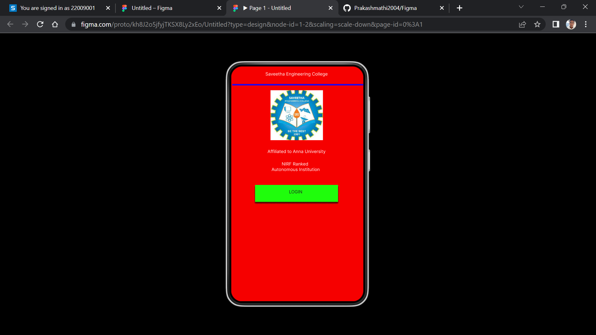
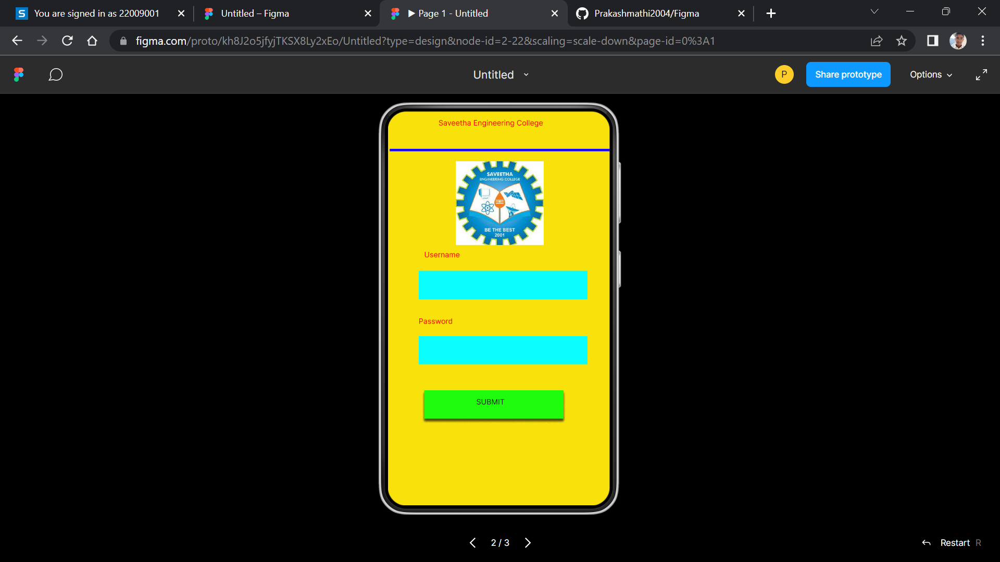
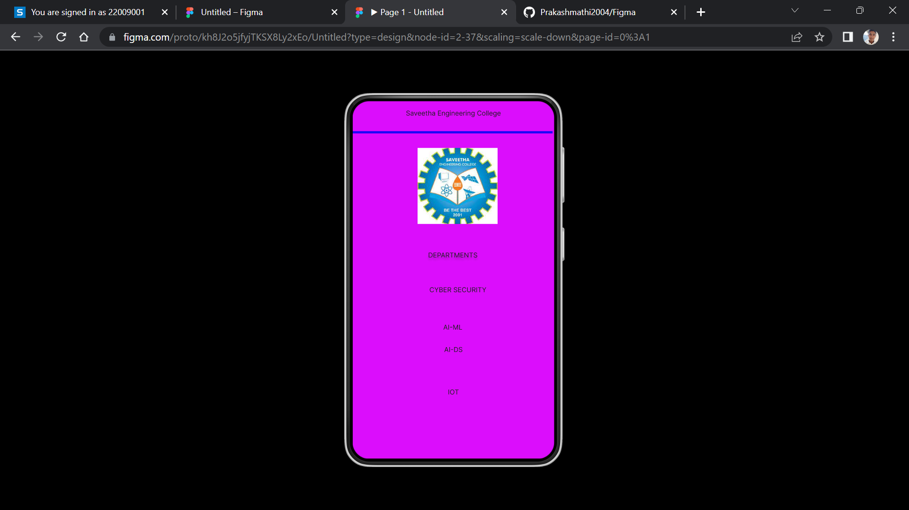

# Event Registration Web Application

## AIM:
To design, develop and deploy a web application for event registration.

## DESIGN STEPS:

### Step 1:
Create a new frame.

### Step 2:
Select any one preset size of your choice.

### Step 3:
Select the shapes you need.

### Step 4:
Import images as needed.

### Step 5:
Create pages based on your need and link them.

### Step 6:

Validate the HTML and CSS code.

### Step 6:

Publish the website in the given URL.

## DESIGN TOOL:
Figma

## CODE:
```
/* Home Page */

position: relative;
width: 360px;
height: 640px;

background: #F60000;
box-shadow: 0px 4px 4px rgba(0, 0, 0, 0.25);


/* Login Page */


position: relative;
width: 360px;
height: 640px;

background: #F9E10C;
box-shadow: 0px 4px 4px rgba(0, 0, 0, 0.25);

/* Saveetha Engineering College */
position: absolute;
width: 334px;
height: 52px;
left: 13px;
top: 14px;

font-family: 'Inter';
font-style: normal;
font-weight: 400;
font-size: 12px;
line-height: 15px;
text-align: center;
color: #1E1E1E;

/* DEPARTMENTS */
position: absolute;
width: 334px;
height: 52px;
left: 12px;
top: 268px;

font-family: 'Inter';
font-style: normal;
font-weight: 400;
font-size: 12px;
line-height: 15px;
text-align: center;

color: #1E1E1E;

text-shadow: 0px 4px 4px rgba(0, 0, 0, 0.25);


/* AI-ML */


position: absolute;
width: 334px;
height: 52px;
left: 12px;
top: 397px;

font-family: 'Inter';
font-style: normal;
font-weight: 400;
font-size: 12px;
line-height: 15px;
text-align: center;
color: #1E1E1E;


/* AI-DS */


position: absolute;
width: 334px;
height: 52px;
left: 13px;
top: 437px;

font-family: 'Inter';
font-style: normal;
font-weight: 400;
font-size: 12px;
line-height: 15px;
text-align: center;
color: #1E1E1E;


/* IOT */


position: absolute;
width: 334px;
height: 40px;
left: 13px;
top: 513px;

font-family: 'Inter';
font-style: normal;
font-weight: 400;
font-size: 12px;
line-height: 15px;
text-align: center;
color: #1E1E1E;


/* CYBER SECURITY */


position: absolute;
width: 334px;
height: 40px;
left: 21px;
top: 330px;

font-family: 'Inter';
font-style: normal;
font-weight: 400;
font-size: 12px;
line-height: 15px;
text-align: center;
color: #1E1E1E;

/* Line 3 */


position: absolute;
width: 357px;
height: 0px;
left: 0px;
top: 56px;
border: 4px solid #1906F7;


/* logo 3 */


position: absolute;
width: 143px;
height: 136px;
left: 116px;
top: 84px;
background: url(logo.jpg);

```

## OUTPUT:





## RESULT:
The program to design, develop and deploy a web application for event registration is completed successfully.